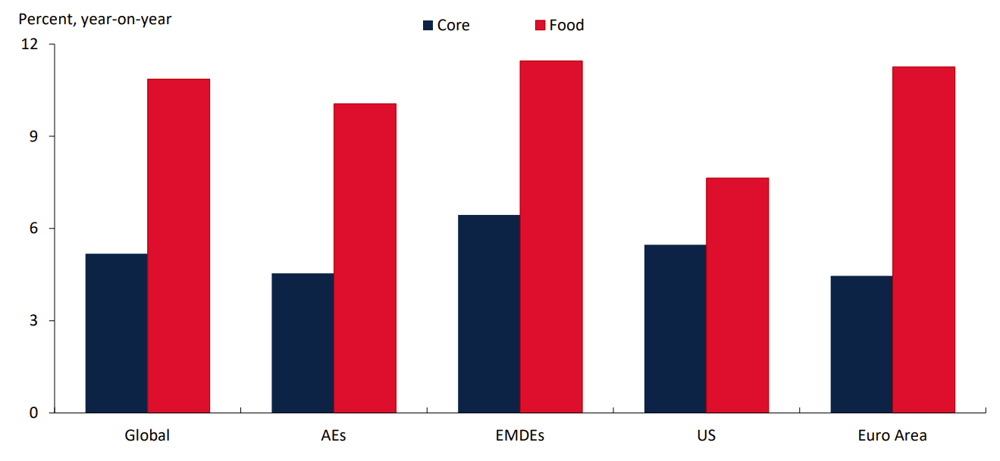

# Policy Responses to Food Price Inflation in India and Egypt 

## Abstract

Food price inflation poses a serious threat to global food security and economic stability. This paper examines Egypt’s wheat subsidy program and India’s rice export ban as government responses to keep the recent cases (2019-2024) of food price inflation at bay in the two countries induced by climate shocks and geopolitical upheavals. Egypt increased subsidies to keep bread affordable, easing the burden on consumers but straining government finances. India restricted rice exports to stabilize domestic prices, benefiting local consumers but disrupting global markets. While both responses offer short-term relief, they could create mid-to long-term challenges. Policymakers must prioritize internationally coordinated efforts to mitigate the spillover effects of their policies to ensure equitable food security in an era of increasing global food system volatility.

Keywords: Egypt, export ban, food price inflation, food subsidies, India

## 1.0	Introduction

The global food system has become increasingly fragile in recent years due to climate shocks, geopolitical tensions, and supply chain disruptions. Between 2022 and 2023, events like the Russia-Ukraine war and El Niño-induced droughts exposed the vulnerabilities of countries dependent on food imports or single-crop agriculture (World Bank, 2024). Food prices surged dramatically during this period, with global food inflation rising by 11% year-on-year (World Bank, 2024) (See Figure 1). This inflation posed a major challenge to economic stability and food security, especially in developing nations.

This review compares the policy responses of Egypt and India; two countries significantly affected by rising food prices. Egypt, the world's largest wheat importer, increased subsidies to keep bread affordable after wheat prices spiked by 44% due to disruptions from the Black Sea region (Reuters, 2023). In contrast, India, the world’s top rice exporter, imposed export restrictions to protect domestic supplies amid climate-driven shortages. This move stabilized domestic prices but caused global rice prices to rise by 15–20%, impacting international markets (Joseph and Abdullah, 2023). Thus, this paper highlights the strengths and weaknesses of these policy choices and explores how governments can better balance short-term relief with long-term food system resilience

 
Figure 1: Core inflation vs food price inflation
 
Source: World Bank, 2024
 
Note: Inflation represents average monthly percent changes over 2022-23, year-on-year

## 2.0	Understanding Food Inflation in India

High and persistent inflation has been a key macroeconomic challenge facing India (Dual & Goel 2021). Elevated inflation coinciding with the growth slowdown has distinguished India from other major emerging market economies in recent years (Eichengreen, Gupta, & Choudhary, 2021). Though several reasons have been put forward to explain this persistently high inflation in India, food inflation has been often singled out as a key driver (Dual & Goel 2021). There have been three peaks of food inflation in the past two decades—1991, 1998, and 2010. Some of the causes of food inflation in India are Demand-side factors such as those related to the changing structure of demand away from cereals toward high-value items such as livestock products.

In 1991, there was significant food inflation in India which was caused by the increased rural wages initiated by the economic liberation of that year (Siddiqui, 2021). There was a shift towards protein-rich foods which affected the demand for various food items. The government managed the situation through policy intervention and structural adjustments. The supply-side intervention was through Agricultural productivity enhancement by irrigation and improved seed varieties. The distribution systems were managed through the availability of commodities at a subsidized rate, and speculative hoardings were addressed. These strategies were effective in controlling inflation in the short run, but challenges remained, most especially in addressing the underlying structural issues in agriculture and market dynamics (Patnaik, 2022)>

India's Food price inflation of 1998 was a result of a sharp increase in the price of fruits, vegetables, pulses, and oilseeds, which are primary products in India (Abraham & Pingali 2021). The Policy intervention employed by the government was The Green Revolution (price incentives, input subsidies, and infrastructure investments). The government also placed restrictions on the export of certain food items to ensure domestic availability and control price rises. Additionally, import duties were reduced for some essential food commodities to increase domestic market supply. These policies limited food inflation in the 1980s and 1990s but led to other challenges like cost-push inflation because of the Minimum Support Price. Also, there was inflationary pressure in the economy because of the strained government budget as a result of the subsidies. Additionally, the policy affected the production of export-banned crops because of the disruptions in farmers' income.

### 2.1	Historical Review of Food Price Inflation Policies in Egypt

Egypt's food subsidy program dates back to the mid-1940s to provide essential goods like sugar, kerosene, edible oil, and tea to its population (Abdalla & Al-Shawarby, 2017). Over time, the program underwent several changes and became deeply rooted in the country's political, social, and economic framework. Budget allocations for food subsidies rose significantly, especially in the 1970s. In response to recommendations from the International Monetary Fund and the World Bank, the Egyptian government announced substantial cuts to food subsidies, including the _Baladi_ bread subsidy, in January 1977 (Thyen & Karadag, 2021). However, widespread public protests forced the government to reverse this decision.

Subsequent reforms included reducing the variety of goods available through ration cards and introducing a two-tier ration card system with fully and partially subsidized options (Amin, 2021). The government also subsidizes agricultural inputs like irrigation water, which is provided free of charge, and fertilizers, whose production costs are lowered through energy subsidies. Despite these efforts, the fertilizer subsidy system has faced persistent challenges, such as distribution bottlenecks, inadequate supplies for farmers, and the diversion of subsidized fertilizers to the black market.

## 3.0	Policy Responses to Food Price Inflation

This section examines two distinct policy approaches to managing food price inflation; India's rice ban policy and Egypt's wheat subsidy program. India's strategy focuses on supply restriction by banning rice exports to stabilize domestic prices, while Egypt employs price control and subsidies to make wheat more affordable for its population. These contrasting approaches have significant implications for both domestic markets and international trade.

### 3.1	Egypt’s Wheat Subsidy Program

Egypt is the world's largest wheat importer and relies heavily on Russia and Ukraine for supplies (Abdalla, Stellmacher, & Becker, 2022). As a result, the 2022 Russia-Ukraine war led to a wheat shortage thereby causing food inflation to surge, with wheat prices rising 44% and sunflower oil prices increasing 32% (Ben & Bilali 2022). To maintain the affordability of bread “eish baladi”, a staple food, the Egyptian government heavily subsidized wheat, covering most production costs This policy is in no way different from the policy the Egyptian Government have been employing to combat food price inflation
The wheat subsidy program is deeply embedded in Egypt's social policy, providing affordable staples to the population and contributing to social equity and political stability. Also, the fortification of “eish baladi bread with iron and folic acid has reached over 50 million Egyptians, which has significantly improved the nutritional intake of low-income groups.

The policy faced challenges in effectively targeting the poorest segments of the population. Leakage and pilferage in the distribution channel remain issues that need to be addressed to enhance the program's efficiency. Also, efforts to increase wheat self-sufficiency could negatively impact other agricultural sectors, such as livestock, due to changes in cropping patterns. Balancing self-sufficiency with the needs of other sectors is essential for overall economic stability
While Egypt's bread subsidy program plays a vital role in controlling wheat price inflation, the ongoing geopolitical tensions highlight the need for diversified wheat import sources and enhanced domestic production capabilities. The situation underscores the importance of international cooperation and investment in agricultural research to ensure long-term food security in Egypt.

These undesirable developments in the policy can be prevented by introducing a tiered subsidy system where Low-income households receive a full subsidy, Middle-income groups receive a partial subsidy, and Wealthy consumers pay market prices. Also, alternative grains like maize, barley, and sorghum, which are cheaper and more drought-resistant should be promoted to reduce Egypt over reliance on wheat. Additionally, Local food processing industries should be supported to create affordable alternatives to wheat-based products. Thereby Reducing pressure on wheat demand and strengthening food security
 
### 3.2	India’s Rice Export Ban

India, the world’s largest rice exporter, imposed a ban on non-basmati white rice exports in July 2023 to curb domestic inflation (Valera et al., 2024). The decision was triggered by El Niño-related droughts reducing domestic rice production, Domestic rice price inflation exceeding 11.5% in mid-2023, and the rise in fertilizer and input costs leading to farmer distress. India's rice export ban was implemented in July 2023, to calm domestic rice prices that had risen over 30% since October 2022. The ban restricted exports of non-basmati rice, which accounted for about 75-80% of India's total rice exports ban was more comprehensive, halting overseas sales of non-basmati rice with immediate effect (Bardhan, 2024). 

The ban has helped stabilize domestic rice prices, which had risen sharply in 2022. Socially, the ban has ensured that India's domestic rice requirements are met, maintaining food security for its large population, and stabilizing domestic rice prices, thereby protecting vulnerable sections of the population, such as low-income households and marginalized communities (Negi, 2022).

This policy however led to a reduction in export earnings. The ban has resulted in significant losses for Indian rice exporters, with estimated losses ranging from $2-3 billion (Valera et al., 2024). This weakened the rupee. Also, it may lead to a permanent loss of India's export market share, as other countries like Thailand may fill the gap. Regaining lost market share can be challenging, even after the ban is lifted. The ban may reduce farmers' incomes, as they may not be able to sell their produce at higher prices in the national market. Socially, the ban may affect the livelihoods of rice millers and traders, who rely on exports for their income. It can also lead to the smuggling of rice, which can undermine the policy's objectives. India’s ban disrupted the global rice trade, affecting countries like Nigeria, Indonesia, and the Philippines, which rely on Indian rice imports. This highlights the spillover effects of national policies on global food security (Elshahawany & Elazhary 2024; Valera et al., 2024).

The rice ban policy can be effective through the implementation of a gradual reduction in exports instead of outright bans to prevent the disruption of the global markets. Stability in global markets could also have been achieved while still protecting domestic food prices by establishing a price-based trigger to allow exports except domestic prices exceed a certain threshold. Likewise, exports under a quota-based system should have been allowed for key trader partners. Buffer stock program where the surplus rice produced in good harvest years is bought by the government and released in deficit years, could also control inflation. The prioritization of rice production due to high procurement rates, leads to overproduction and resource depletion. The government should offer higher subsidies for alternative crops (e.g., millet, pulses to reduce the overdependency on rice.
offer higher subsidies for alternative crops (e.g., millet, pulses to reduce the overdependency on rice.

### 3.3	Comparative Analysis: Export Bans vs. Food Subsidies

The contrasting policy responses of India and Egypt to food price inflation which are export bans and food subsidies, respectively, reveal divergent priorities, mechanisms, and consequences. India’s 2023 ban on non- basmati rice exports aimed to stabilize domestic prices amid El Niño-driven production declines, while Egypt’s wheat subsidy program sought to shield its population from soaring global wheat prices following the Russia-
 
Ukraine conflict. Both policies underscore the complex trade-offs governments face when balancing domestic welfare against fiscal stability and global market dynamics.
India’s export ban, enacted in July 2023, targeted non-basmati rice, which constituted 75–80% of its rice exports. The immediate objective was to curb domestic inflation, which had surpassed 11.5% by mid-2023, driven by reduced harvests and rising input costs. By restricting exports, India prioritized domestic consumers, ensuring affordable rice for its 1.4 billion people. This measure succeeded in tempering price spikes, particularly benefiting low-income households. However, the ban imposed significant collateral costs: farmers lost access to lucrative export markets, rice exporters faced $2–3 billion in losses, and smuggling proliferated as traders sought to bypass restrictions. Furthermore, the policy distorted agricultural incentives, as guaranteed procurement prices for rice discouraged diversification into less water-intensive crops like millet or pulses.

In contrast, Egypt’s wheat subsidy program, a cornerstone of its social safety net since the 1940s, focused on direct price controls. The government procured wheat at fixed rates and distributed subsidized eish baladi (baladi bread) at 1 Egyptian pound per loaf, ensuring affordability for over 50 million citizens. The program also improved nutritional outcomes through mandatory flour fortification. Yet its fiscal costs were staggering, consuming 1.5% of GDP in 2022. Inefficiencies in targeting meant subsidies often leaked to wealthier households, while Egypt’s reliance on imports for 60% of its wheat exposed the system to global market volatility. The Russia-Ukraine war starkly highlighted this vulnerability, as supply disruptions forced Egypt to seek costlier alternatives, further straining public finances.

Globally, the two policies generated ripple effects with starkly different implications. India’s export ban disrupted international rice markets, triggering a 15–20% price surge and exacerbating food insecurity in import-dependent nations like Nigeria and the Philippines. The abrupt restriction eroded India’s reputation as a reliable supplier, enabling competitors like Thailand and Vietnam to capture its market share. Conversely, Egypt’s subsidies indirectly inflated global wheat demand, exacerbating price pressures. Both policies underscore how national interventions can destabilize global food systems, particularly in an era of fragmented trade and climate volatility.

Long-term sustainability remains a critical concern. India’s export bans risk entrenching a cycle of reactive policymaking, discouraging investments in climate-resilient agriculture or crop diversification. Similarly, Egypt’s subsidies, while politically sacrosanct, perpetuate fiscal deficits and import dependency, with domestic wheat production covering less than 40% of demand. Both nations face equity challenges: India’s bans disproportionately harm smallholder farmers, while Egypt’s subsidies fail to reach the most vulnerable due to bureaucratic inefficiencies.

## 4.0	Conclusion

The divergent approaches of India and Egypt to food price inflation illuminate the inherent tensions between immediate crisis management and sustainable food security. India’s export ban stabilized domestic prices but disrupted global trade and penalized farmers, illustrating the paradox of prioritizing short-term consumer welfare at the expense of long-term agricultural resilience. Egypt’s subsidy program preserved access to affordable bread but entrenched fiscal vulnerabilities and import dependency, revealing the limits of price controls in structurally fragile economies.

Three critical lessons emerge. First, policy precision is paramount. Export restrictions could be tempered with tiered quotas or price triggers to avoid market shocks, while subsidies require biometric targeting or cash transfers to reduce leakage. Second, unilateral actions demand multilateral safeguards. India’s ban worsened global inequities, underscoring the need for coordinated grain reserves or trade agreements to stabilize prices during crises. Third, systemic reforms are non-negotiable. India must incentivize crop diversification and climate adaptation, while Egypt should invest in domestic wheat production and alternative staples like sorghum to reduce import reliance.

## References

Abdalla M, & Al-Shawarby S. (2017). The Tamween food subsidy system in Egypt: evolution and recent implementation reforms. In: Alderman H, Gentilini U, Yemtsov R, eds. The 1.5 billion people question: food, vouchers, or cash transfers? World Bank Group, Washington. Retrieved on February 16, 2025, from https://www.calpnetwork.org/wp-content/uploads/2020/03/1510242015.The_1_5_Billion_People_Question-  1.pdf.

Abraham, M., & Pingali, P. (2021). Shortage of pulses in India: Understanding how markets incentivize supply response. Journal of Agribusiness in Developing and Emerging Economies, 11(4), 411-434.

Amin, G. A. (2021). Egypt's economic predicament: A study in the interaction of external pressure, political folly and social tension in Egypt, 1960-1990, Brill. (Vol. 51).

Bardhan, A. R. (2024). Leveraging the rice export ban for crop substitution in India. In Leveraging the rice export ban for crop substitution in India: Bardhan, Arya Roy. New Delhi, India: ORF, Observer Research Foundation.

Ben Hassen, T., & El Bilali, H. (2022). Impacts of the Russia-Ukraine war on global food security: towards more sustainable and resilient food systems?. Foods, 11(15), 2301.

Abdalla, A., Stellmacher, T., & Becker, M. (2022). Trends and prospects of change in wheat self-sufficiency in Egypt.	Agriculture,	13(1),	7.
https://doi.org/10.3390/foods11152301.

Dua, P., & Goel, D. (2021). Determinants of inflation in India. The Journal of developing areas, 55(2).

Eichengreen, B., Gupta, P., & Choudhary, R. (2021). Inflation targeting in India: An interim assessment. In India Policy Forum (Vol. 17, No. 1, pp. 77-141). National Council of Applied Economic Research.

Elshahawany, D. N., & Elazhary, R. H. (2024). Government spending and regional poverty alleviation: evidence from	Egypt.	Asia-Pacific	journal	of	regional	science,	8(1),	111-135. https://doi.org/10.1007/s41685-023-00318-2.

Hassoun, A., Al-Muhannadi, K., Hassan, H. F., Hamad, A., Khwaldia, K., Buheji, M., & Al Jawaldeh, A. (2024). From acute food insecurity to famine: how the 2023/2024 war on Gaza has dramatically set back sustainable development goal 2 to end hunger. Frontiers in Sustainable Food Systems, 8, 1402150. https://doi.org/10.3389/fsufs.2024.1402150

Jaravel, X. (2021). Inflation inequality: Measurement, causes, and policy implications. Annual Review of Economics, 13(1), 599-629.

Joseph Glauber & Abdullah Mamun. (2023). India’s new ban on rice exports: potential threats to global supply, prices, and food security. International Food Policy Research Institute (IFPRI) blog. https://www.ifpri.org/blog/indias-new-ban-rice-exports-potential-threats-global-supply-prices-and-food-security/#:~:text=The%20ban%20is%20the%20latest,to%20the%20Russia%2DUkraine%20war. Accessed on February 16, 2025.

Kpodar, K., & Liu, B. (2022). The distributional implications of the impact of fuel price increases on inflation. Energy Economics, 108, 105909.

Negi, D. S. (2022). Global food price surge, in-kind transfers and household welfare: Evidence from India. World
Development,	158,	106009. https://doi.org/10.1016/j.worlddev.2022.106009

Patnaik, P. (2022). The Indian Economy Under Neo-liberalism. El trimestre económico, 89(354), 393-419.

Ramdas, S. R. (2023). The G20 Agriculture Policy, Food Systems and Global Supply Chains: The Answer to India's Food Security and Farmers' Livelihood Security?. India & the G20: Legacy & Prospects for Multilateralism amidst a Polycrisis, 129.

Reuters. (2023). Egypt raises local wheat procurement price 44% amid inflation. https://financialpost.com/pmn/business-pmn/egypt-raises-local-wheat-procurement-price-44-amid-inflation. Accessed on February 16, 2025.

Russia-Ukraine war: Implications for global and regional food security and potential policy responses. Global Food	Security,	36,	100675.
https://doi.org/10.1016/j.gfs.2023.100675

Siddiqui, K. (2023). Indian agriculture, role in the economy and economic liberalisation: Revisited. Turkish Economic Review, 10(3-4), 72-89.

Thyen, K., & Karadag, R. (2021). Between affordable welfare and affordable food: Internationalized food subsidy reforms in Egypt and Tunisia. Social Policy & Administration, 55(6), 1050-1065.

Valera, H. G. A., Mishra, A. K., Pede, V. O., Yamano, T., & Dawe, D. (2024). Domestic and international impacts of rice export restrictions: The recent case of indian non-basmati rice. Global Food Security, 41, 100754. https://doi.org/10.1016/j.gfs.2024.100754

World Bank (2024). Global Food Price Inflation: Trends, Channels, and Insights. World Bank 2024 AAEA Annual Meetings Workshop on “Food Prices and Forecasting” July 31 – August 1, 2024, New Orleans Marriott.

